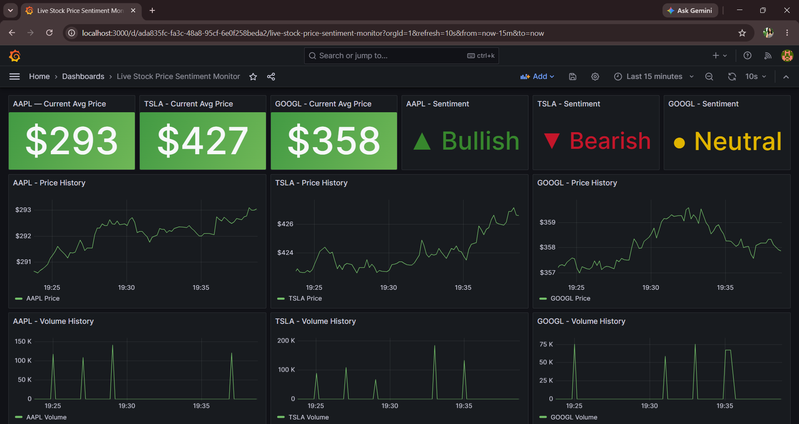

# Live Stock Price Sentiment Monitor

A real-time streaming pipeline that ingests live stock price data, computes a momentum-based sentiment score, and visualizes both in Grafana dashboards — all running on Docker Compose.

## Overview

This project streams live price data for **AAPL, TSLA, and GOOGL**, processes it in real time with PySpark Structured Streaming, derives a momentum-based sentiment signal, and serves everything through a 12-panel Grafana dashboard backed by Redis.

## Live Dashboard



*Captured during NYSE market hours — showing live price movement, volume, and momentum-based sentiment (Bullish/Bearish/Neutral) across AAPL, TSLA, and GOOGL.*

## Architecture

```
yfinance (host)  --producer-->  Kafka  --consumer-->  PySpark Structured Streaming
                                                              |
                                                              v
                                                        Redis (hash + streams)
                                                              |
                                                              v
                                                          Grafana
```

- **Producer** runs on the host machine, pulling real price data via `yfinance`
  - Market hours: `history(period="1d", interval="1m")`
  - Off-hours fallback: `fast_info`
- **Kafka** buffers the price stream
- **PySpark Structured Streaming** (running in a Docker container) consumes from Kafka, computes rolling price/volume aggregates and the sentiment score, and writes results to Redis
- **Redis** stores, per ticker:
  - `{TICKER}:latest` — hash with `avg_price`, `total_volume`, `window_end`, `sentiment_score` (float), `sentiment_label` (string)
  - `{TICKER}:price_stream` — Redis Stream of historical price values
  - `{TICKER}:volume_stream` — Redis Stream of historical volume values
  - `{TICKER}:sentiment_stream` — Redis Stream of historical sentiment scores/labels
- **Grafana** reads directly from Redis to render the dashboard

## Dashboard

12 panels across 3 tickers (AAPL, TSLA, GOOGL):

| Panel type | Count | Source |
|---|---|---|
| Current Price (Stat) | 3 | `{TICKER}:latest` |
| Price History (Time series) | 3 | `{TICKER}:price_stream` |
| Volume History (Time series) | 3 | `{TICKER}:volume_stream` |
| Sentiment (Stat, color-coded) | 3 | `{TICKER}:latest` → `sentiment_score` |

**Sentiment methodology:**
A momentum-based score is computed from a rolling deque of the last 5 windows (30 seconds each, ≈2.5 minutes of lookback), clamped to the range **±100**. Grafana renders it via an `HGET {TICKER}:latest sentiment_score` query, using range-based value mappings for color coding:
- `score < -5` → **Bearish** (red)
- `score > 5` → **Bullish** (green)
- otherwise → **Neutral** (yellow)

A "Filter by name" transform isolates the `sentiment_score` field for the Stat panel visualization.

## Tech Stack

- **Streaming:** Apache Kafka, PySpark Structured Streaming
- **Data source:** yfinance
- **Storage:** Redis (hashes + streams)
- **Visualization:** Grafana
- **Orchestration:** Docker Compose
- **Language:** Python

## Running Locally

1. Clone the repo and set up the project directory structure (see `docker-compose.yml`)
2. Start the stack:
   ```bash
   docker compose up -d
   ```
3. Run the producer on the host:
   ```bash
   python producer/stock_producer.py
   ```
4. Submit the Spark consumer job:
   ```bash
   docker exec -it spark /opt/spark/bin/spark-submit \
     --jars /opt/spark-app/jars/spark-sql-kafka-0-10_2.12-3.5.1.jar,/opt/spark-app/jars/kafka-clients-3.4.0.jar,/opt/spark-app/jars/spark-token-provider-kafka-0-10_2.12-3.5.1.jar,/opt/spark-app/jars/commons-pool2-2.11.1.jar \
     --master local[*] \
     /opt/spark-app/consumer.py
   ```
5. Open Grafana at `http://localhost:3000` and view the dashboard

## Project Structure

```
stock-sentiment-streaming/
├── docker-compose.yml
├── .gitignore
├── README.md
├── producer/
│   └── stock_producer.py      # host-side yfinance -> Kafka producer
├── spark/
│   └── Dockerfile
└── spark-app/
    ├── consumer.py             # PySpark Structured Streaming job
    └── jars/                   # Kafka connector JARs for spark-submit
```

## Notes / Known Constraints

- Producer must run on the host (not containerized) in the current setup
- Off-hours price data falls back to `fast_info` rather than intraday bars
- `redis` Python package is installed into the Spark image via the Dockerfile

## License

This project is licensed under the MIT License.
